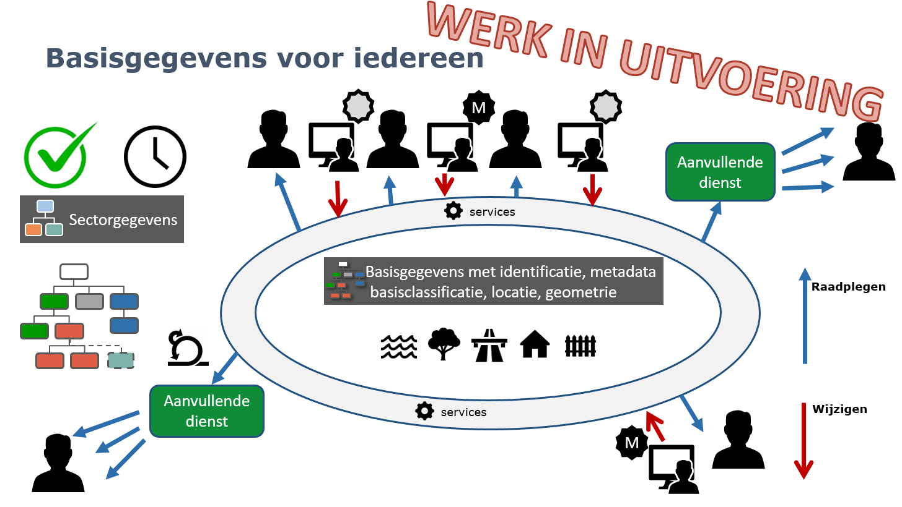
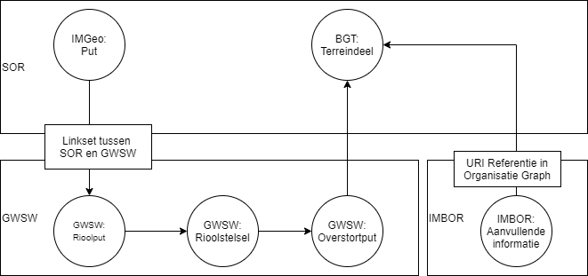
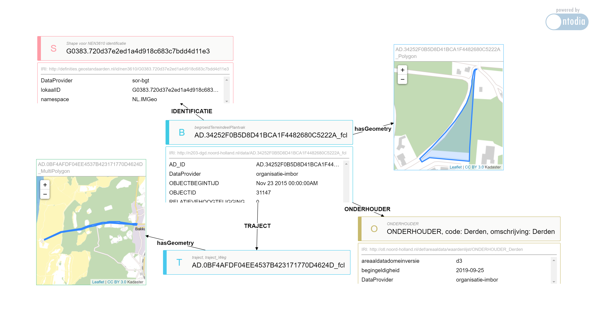

# Samenhangende Objecten Registratie en aanvullende domein modellen

Deze datastory laat zien hoe de Samenhangende Objecten Registratie (SOR) kan werken in combinatie met aanvullende domein modellen.
Met linked data kunnen we gegevens uit de SOR in samenhang met aanvullende registraties gebruiken. In dit voorbeeld worden GWSW en IMBOR gebruikt in combinatie met de BGT.

## scenario

Er is een incident (brand) waar een grote hoeveelheid bluswater bij vrijkomt. We willen weten waar dit eventueel vervuilde bluswater in de omgeving terecht komt.
Hiervoor beginnen we onze analyse in de SOR om de betreffende Put te vinden in IMGeo. Dan zoeken we aanvullende informatie in GWSW. 
Op basis van de informatie in GWSW kunnen we de overstortput vinden waar het bluswater in de omgeving terecht zou komen.
Vanaf deze plek zoeken we in de SOR over welke terreindelen het gaat. Tenslotte bevragen we via Ontodia de organisatie specifieke IMBOR kennisgraph over aanvullende informatie van dit terreindeel. 

## Integratie van de SOR met aanvullende knowledge graphs

De story laat twee verschillende manieren zien waarop er geintegreerd kan worden tussen de SOR en aanvullende registraties.

In de eerste stap tussen een IMGEO:Put en een GWSW:Rioolput wordt gebruik gemaakt van een linkset. Hierin wordt vastgelegd hoe de twee registraties met elkaar samenhangen.
Deze linkset is dus in principe tool onafhankelijk. Het is wel gewenst dat er governance komt op de snijvlakken. Wie is er van deze mappings en linksets?

De aanvullende 'dienst' in de GWSW dataset is dus het gebruiken van het rioolstelsel om de betreffende overstortput te vinden.

De tweede integratie die getoond wordt is op basis van functionaliteit in de Ontodia browser. De browser is geconfigureerd om over meerdere endpoints heen bevragingen te doen.
Omdat er in de organisatiespecifieke imbor knowledgegraph uri's zijn opgenomen uit de basisregistratie, kan Ontodia de informatie geintegreerd weergeven.
Hierbij is er dus geen sprake van een echte Linkset op het snijvlak, maar het opnemen van verwijzingen naar basisregistratie objecten in de eigen knowledge graph. 
Deze zou dus ook afgeschermd kunnen zijn voor exclusief gebruik binnen de organisatie.

### Stappen

Zoek de corresponderende GWSW Rioolput bij de IMGEO put (gebruikt dus de linkset tussen IMGeo en GWSW).
Als je klikt op de pushpin zie je dus de indentifier uit de imgeo registratie en uit de GWSW registratie.

Zoek in GWSW de dichtstbijzijnde Overstortput die via het rioolstelsel verbonden is met de betreffende rioolput (dus niet alleen hemelsbreed)
Hier zie je het oorspronkelijke punt (in blauw) en de dichtstbijzijnde overstortput (in groen)

Zoek in de BGT welke terreindelen er bij deze overstortput liggen (zou een gefedereerde geosparql query moeten zijn, maar die werkt dus niett)
Dus in dit geval wordt het coordinaat uit GWSW 'hard' in de query meegegeven.

Als je vervolgens op het vlak klikt verschijnt er een popup met een url naar Ontodia.

In Ontodia kun je dus aanvullende informatie uit de IMBOR dataset vinden bij het BGT vlak:
https://labs.kadaster.nl/demonstrators/graph-browser/ontodia-imbor?resource=http://bgt.basisregistraties.overheid.nl/bgt/id/Groenvoorziening/G0383.720d37e2ed1a4d918c683c7bdd4d11e3

##bevindingen

Bij het werken aan deze datastory zijn we tegen een aantal zaken aangelopen:
* Als we een Linkset tussen IMGeo en GWSW willen hebben. Wie is daar dan van, hoe wordt deze bijgehouden?
* Een gefedereerde query over meerdere endpoints lukt niet met geosparql. 
